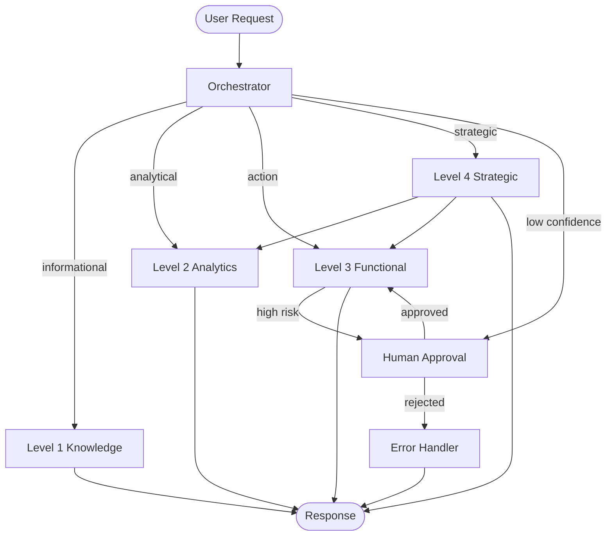
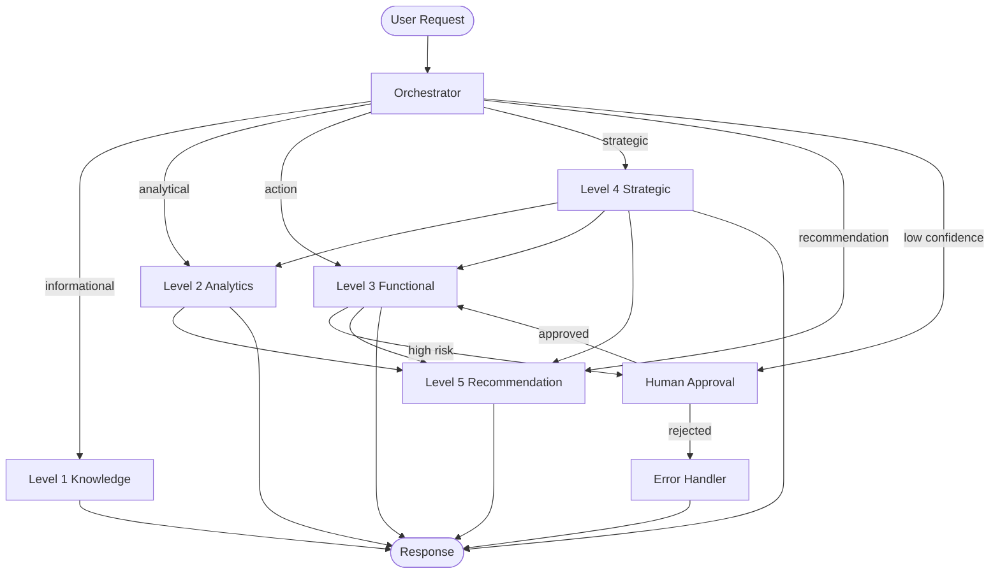

# 🌐 LangGraph Multi-Agent Architecture

**TL;DR**: A directed graph where the orchestrator node routes to 4 specialist nodes. Level-4 can spawn sub-graphs. Human approval checkpoints interrupt the graph before high-risk actions.

---

## Graph Nodes

| Node | Role | Tools available |
|------|------|----------------|
| `orchestrator` | Entry point; classifies intent and routes | `log_audit_event`, `request_human_approval` |
| `level1_knowledge` | RAG retrieval, generation, and summarisation across policies, emails, and CRM notes | `search_customer_profile`, `search_policy_docs`, `get_kyc_status`, `multi_query_search` |
| `level2_analytics` | Text-to-SQL via `create_sql_query_chain`, segmentation, NLP, Customer 360, visualizations | `run_sql_query`, `generate_segment`, `visualise`, `analyze_sentiment`, `summarize_text`, `get_customer_360`, `get_sales_analytics`, `get_support_analytics` |
| `level3_functional` | Tool-using action executor | `search_customer_profile`, `get_kyc_status`, `recommend_offer`, `draft_email`, `send_notification`, `create_case` |
| `level4_strategic` | Goal decomposition, multi-agent coordination, self-reflection loop | `generate_segment`, `recommend_offer`, `schedule_campaign`, `request_human_approval`, `reflect_and_replan`, `check_kpi_deviation` |
| `human_approval` | Interrupt node — waits for human decision | — |
| `error_handler` | Catches node failures; retries or escalates | `log_audit_event`, `request_human_approval` |

---

## Shared State Schema

```python
class AgentState(TypedDict):
    request_id: str           # UUID for full traceability
    user_id: str              # Authenticated user
    original_request: str     # Raw user input
    intent: str               # Classified intent
    routed_to: str            # Which node handled the request
    customer_id: Optional[str]
    workflow_id: Optional[str]
    messages: list[BaseMessage]
    tool_calls: list[dict]    # All tool invocations this session
    approval_status: Optional[str]  # "pending" | "approved" | "rejected"
    error: Optional[str]
    audit_trail: list[dict]   # Append-only log of all actions
    confidence: float         # Orchestrator routing confidence (0–1)
```

---

## Router Logic

```python
def route(state: AgentState) -> str:
    if state["confidence"] < 0.6:
        return "human_approval"          # Low confidence → escalate
    intent = state["intent"]
    if intent == "informational":        return "level1_knowledge"
    if intent == "analytical":           return "level2_analytics"
    if intent == "action":               return "level3_functional"
    if intent == "strategic":            return "level4_strategic"
    return "human_approval"              # Unknown → escalate
```

**Confidence threshold**: `< 0.6` → always escalate to human before routing.

---

## Graph Edges

```
START → orchestrator
orchestrator → level1_knowledge | level2_analytics | level3_functional | level4_strategic | human_approval
level4_strategic → level2_analytics  (sub-goal: segmentation)
level4_strategic → level3_functional (sub-goal: execution)
level3_functional → human_approval   (IF risk_level = "high" OR action affects > 100 customers)
human_approval → [resume node] | error_handler  (on rejection)
any node → error_handler            (on unhandled exception)
error_handler → [retry node] | human_approval
any node → END
```

---

## Approval Checkpoints

| Trigger | Node | Behaviour |
|---------|------|-----------|
| `send_notification` to > `APPROVAL_BULK_THRESHOLD` customers | `level3_functional` | Pause; await human approval |
| `schedule_campaign` with reach > `APPROVAL_CAMPAIGN_REACH_THRESHOLD` | `level4_strategic` | Pause; await human approval |
| `risk_score > APPROVAL_RISK_SCORE_THRESHOLD` on any action | `level3_functional` | Pause; flag to compliance |
| Orchestrator confidence < 0.6 | `orchestrator` | Pause; ask user to clarify |
| KYC expired + financial action | `level3_functional` | Block; create KYC remediation case |

Approval timeout: 60 minutes → default `approved: false` → route to `error_handler`.

---

## Memory Design

| Scope | Storage | TTL |
|-------|---------|-----|
| Session (short-term) | In-memory `ChatMessageHistory` | Session end |
| Customer context | In-memory LRU cache keyed by `customer_id` | Process lifetime |
| Vector store (policies, emails, notes) | ChromaDB `PersistentClient` at `CHROMA_PERSIST_DIR` | Permanent |
| Campaign outcomes (long-term) | JSONL file at `OUTCOMES_PATH` | Permanent |
| Audit trail | Append-only JSONL at `AUDIT_LOG_PATH` | 7 years (compliance) |

---

## Retry & Error Handling

```
Tool failure → retry up to N times (per tool definition)
             → if still failing → route to error_handler
error_handler → log_audit_event(error)
             → if retryable → retry with backoff
             → if not retryable → request_human_approval
             → if approval rejected → return graceful error to user
```

Graceful degradation: if Level-2 is unavailable, Level-1 can answer with cached data and a disclaimer.

---

## Observability Hooks

Every node emits structured events via `@node_trace` decorator (`src/observability.py`):

```python
# node_start — emitted on entry
{ "event": "node_start", "node": str, "request_id": str, "timestamp": str }

# node_end — emitted on exit
{
  "event": "node_end",
  "node": str,
  "request_id": str,
  "duration_ms": int,       # wall-clock ms
  "tool_calls": int,        # number of tool invocations
  "tokens_used": int,       # total tokens consumed by LLM calls in this node
  "error": str | null,
  "timestamp": str
}
```

`tokens_used` is populated by `_TokenTrackingLLM` in `src/llm.py`, which intercepts every `llm.invoke()` call and calls `record_tokens(request_id, total_tokens)`. The `node_trace` decorator pops the accumulated count at node exit.

When `LANGFUSE_SECRET_KEY` is set, each `node_end` event is also sent to a self-hosted Langfuse instance (`LANGFUSE_HOST`, default `http://localhost:3000`) as a trace span.

**Metrics to track**:
- Routing accuracy (intent classification confidence distribution)
- Tool call latency p50/p95/p99
- Approval rate and approval latency
- Error rate per node
- Token cost per request (now populated in `tokens_used`)

## Output Guardrails

All LLM-generated text passes through `guardrail_check` (`src/guardrails.py`) before reaching the user:

| Check | Rule | Action |
|-------|------|--------|
| PII — email | Regex match | Redact to `[email redacted]` |
| PII — phone | Regex match | Redact to `[phone redacted]` |
| Forbidden phrases | `buy shares`, `financial advice`, etc. | Redact to `[redacted]` |
| Constitutional LLM check | 4 principles evaluated by LLM | List violations |

Guardrail can be disabled via `GUARDRAIL_ENABLED=false` (e.g. for unit tests).

---

## Audit Trail

Every action appends to `state["audit_trail"]` and calls `log_audit_event`:

```json
{
  "audit_id": "uuid",
  "request_id": "uuid",
  "user_id": "string",
  "agent_id": "level3_functional",
  "action": "send_notification",
  "customer_id": "CUST-007",
  "inputs": { "channel": "email", "template_id": "T-UPSELL-01" },
  "outputs": { "status": "sent", "message_id": "MSG-999" },
  "timestamp": "2025-07-28T10:30:00Z",
  "approved_by": "user@bank.com"
}
```

Audit records are immutable. Retention: 7 years. Access: compliance role only.

---

## Full Graph (Mermaid)




---

## Level-5 Recommendation Node

| Node | Role | Tools available |
|------|------|-----------------|
| `level5_recommendation` | Personalized product recommendations using hybrid algorithms | `recommend`, `evaluate_recommendations` |

**Inputs**: `customer_id`, `top_k` (optional), `exclude_purchased` (optional)

**Outputs**: Ranked product recommendations with confidence scores and explanations

**Cold-Start Handling**: If customer has < 3 interactions, returns segment-based or popular items with `cold_start: true`

**Hybrid Ranking**: Combines collaborative filtering (40%), behaviour signals (30%), content matching (20%), and popularity (10%)

---

## Level-4 Monitoring Tools

| Tool | Purpose | Inputs | Outputs |
|------|---------|--------|---------|
| `get_kpi_report` | Retrieve KPI baseline for a segment | `segment_id` | `{ campaigns_run, avg_conversion_rate, avg_open_rate, summary }` |
| `record_campaign_outcome` | Persist campaign results and compute deviation | `campaign_id, segment_id, goal, estimated_reach, kpi_baseline, actual_conversions, actual_opens` | `{ status, needs_reanalysis, deviation }` |
| `check_kpi_deviation` | Compare current KPI vs target | `segment_id, target_conversion_rate?` | `{ current_conversion_rate, target_conversion_rate, deviation, action_required }` |
| `reflect_and_replan` | Self-reflection entry point | `segment_id, goal` | `{ should_replan, reason, recommended_action, deviation_report }` |

**Self-Reflection Loop**: After each campaign cycle, Level-4 calls `reflect_and_replan()`. If `should_replan: true`, the agent re-decomposes the goal with refined context and re-runs the campaign cycle with tighter segment filters.

**Deviation Threshold**: Configurable via `KPI_DEVIATION_THRESHOLD` env var (default 0.10 = 10%). If actual conversion rate deviates from baseline by more than this, `action_required: true`.

**Re-Plan Trigger**: `should_replan: true` if:
- KPI deviation exceeds threshold, OR
- Recent campaign outcome flagged `needs_reanalysis: true`

---

## Updated Full Graph (Mermaid)



---

## Observability & Monitoring

Every node emits structured events via `@node_trace` decorator (`src/observability.py`):

**Node Start Event**:
```json
{
  "event": "node_start",
  "node": "level4_strategic",
  "request_id": "uuid",
  "timestamp": "2025-01-28T10:30:00Z"
}
```

**Node End Event**:
```json
{
  "event": "node_end",
  "node": "level4_strategic",
  "request_id": "uuid",
  "duration_ms": 1234,
  "tool_calls": 5,
  "tokens_used": 2048,
  "error": null,
  "timestamp": "2025-01-28T10:30:01Z"
}
```

**Langfuse Integration**: When `LANGFUSE_SECRET_KEY` is set, each `node_end` event is sent to a self-hosted Langfuse instance (`LANGFUSE_HOST`, default `http://localhost:3000`) as a trace span.

**Metrics to Track**:
- Routing accuracy (intent classification confidence distribution)
- Tool call latency p50/p95/p99
- Approval rate and approval latency
- Error rate per node
- Token cost per request
- KPI deviation trends (Level-4)
- Recommendation quality metrics (Level-5)
