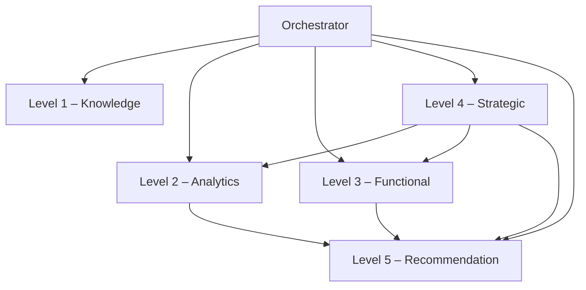

# 🧠 Agentic AI System – Developer Guide

### Architecture

The system uses a hierarchical multi‑agent design implemented with LangGraph and LangChain. An orchestrator node routes incoming tasks to specialised agents based on intent. Each agent exposes a set of tools that can be invoked via defined APIs.



### LLM Provider Configuration

All agents obtain their LLM through a single universal factory at `src/llm.py`. Switch providers by setting `LLM_PROVIDER` in your `.env` — no code changes required.

| `LLM_PROVIDER` | Backend | Required env vars | Best for |
|----------------|---------|-------------------|---------|
| `openai` (default) | OpenAI API | `OPENAI_API_KEY`, `OPENAI_MODEL` | Production, highest capability |
| `ollama` | Local Ollama server | `OLLAMA_BASE_URL`, `OLLAMA_MODEL` | Local dev, privacy-sensitive, offline |
| `gptec` | GPTec / OpenAI-compatible endpoint | `GPTEC_API_URL`, `GPTEC_API_KEY`, `GPTEC_MODEL` | On-premise, private cloud, custom models |

**OpenAI example:**
```bash
LLM_PROVIDER=openai
OPENAI_API_KEY=<key>
OPENAI_MODEL=gpt-4o-mini
```

**Ollama example:**
```bash
LLM_PROVIDER=ollama
OLLAMA_BASE_URL=http://localhost:11434
OLLAMA_MODEL=llama3
# Install: https://ollama.com — then: ollama pull llama3
```

**GPTec example:**
```bash
LLM_PROVIDER=gptec
GPTEC_API_URL=https://your-gptec-host/v1
GPTEC_API_KEY=<key>
GPTEC_MODEL=your-model-name
```

All providers return a LangChain `BaseChatModel`. The factory is at `src/llm.py` — to add a new provider, add one function there and one `if` branch in `get_llm()`.

### Agent Tool Definitions

| Agent | Tool | Description |
|------|------|-------------|
| **Level 1** | `search_customer_profile` | Fetch customer record by ID or name. |
| | `search_policy_docs` | Single-query vector search across `policy_docs`, `emails`, or `notes` collection. |
| | `get_identity_status` | Identity verification status and expiry for a customer. Primary function. |
| | `get_kyc_status` | Backwards-compatible alias for `get_identity_status`. |
| | `multi_query_search` | MultiQueryRetriever — LLM-expanded queries across all collections by default. |
| **Level 2** | `run_sql_query` | Read-only SQL via `create_sql_query_chain` + injection guard. |
| | `generate_segment` | K-means or rule-based segmentation (scikit-learn). |
| | `visualise` | Matplotlib charts saved to `data/charts/`. |
| | `analyze_sentiment` | RoBERTa-based sentiment analysis (positive/neutral/negative). |
| | `summarize_text` | BART-based text summarization. |
| | `get_customer_360` | Unified view: CRM + Sales + Social + Support. |
| | `get_sales_analytics` | Revenue analysis by product/channel. |
| | `get_support_analytics` | Ticket volume and resolution metrics. |
| **Level 3** | `recommend_offer` | NBA-scored offer selection with cross-sell rules. |
| | `draft_email` | Personalised email from template + customer data. |
| | `send_notification` | Consent-gated email/SMS/push. Threshold: `APPROVAL_BULK_THRESHOLD`. |
| | `create_case` | Open CRM case with deduplication. |
| | `request_human_approval` | Pause workflow for human sign-off. |
| | `score_leads` | Multi-factor prospect ranking for a given offer. |
| | `enrich_customer` | Multi-source enrichment: credit bureau, business registry, location. |
| | `bulk_recommend` | Segment-level execution plan with consent + approval gates. |
| | `upsell_recommend` | Higher-tier product recommendations based on purchase categories. |
| | `user_based_recommend` | Segment peer behavior recommendations. |
| | `collaborative_recommend` | Cross-customer similarity recommendations. |
| **Level 4** | `schedule_campaign` | Multi-step campaign scheduler. Threshold: `APPROVAL_CAMPAIGN_REACH_THRESHOLD`. |
| | `get_kpi_report` | KPI baseline for a segment. |
| | `record_campaign_outcome` | Persist outcome + trigger feedback loop. |
| | `reflect_and_replan` | Self-reflection: checks KPI deviation, returns re-plan directive. |
| | `check_kpi_deviation` | Compare current KPI vs target; flags if > `KPI_DEVIATION_THRESHOLD`. |
| **Level 5** | `recommend` | Hybrid product recommendations (collaborative + behaviour + content + popularity). |
| | `evaluate_recommendations` | Offline evaluation: precision@K, recall@K, MAP, NDCG. |
| **All** | `log_audit_event` | Immutable append-only audit record. |

Full contracts: `docs/developer/agent-tool-definitions.md`

### API Specifications

- All agent calls are stateless functions returning JSON. Authentication is via a bearer token.
- Error codes follow HTTP semantics: `400` for bad requests, `403` for forbidden actions, `500` for internal errors.
- Rate limits apply: 60 requests per minute per agent.

### New Modules (Gap Closure)

| Module | Purpose |
|--------|---------|
| `src/config.py` | Centralised runtime config — all thresholds read from env vars via `load_config()` |
| `src/guardrails.py` | ConstitutionalChain-style output validator — PII redaction + LLM principle check |
| `src/tools/monitoring.py` | KPI tracking, `reflect_and_replan`, `check_kpi_deviation`, `record_campaign_outcome` |
| `src/observability.py` | `@node_trace` decorator; emits structured events; optional Langfuse integration (self-hosted) |
| `src/tools/loader.py` | File parsers for `.txt`, `.md`, `.pdf`, `.docx`, `.eml` — used by ingestion pipeline |
| `src/tools/recommender.py` | Recommendation engine — collaborative filtering, behaviour scoring, hybrid ranking, cold-start handling, offline evaluation |
| `src/agents/level5.py` | Level 5 agent node — routes recommendation requests, calls recommender, logs audit |
| `scripts/generate_recommendation_data.py` | Generates 200 products + 5000 interactions for recommendation demos |
| `scripts/ingest_folder.py` | Walks `data/docs/`, parses files via `loader.py`, ingests into ChromaDB, tracks `data/ingested.json` |

### Configurable Thresholds

All thresholds are in `.env` / `.env.example`. No hardcoded values in code:

| Env var | Default | Used by |
|---------|---------|--------|
| `APPROVAL_BULK_THRESHOLD` | 100 | Level-3 `send_notification` |
| `APPROVAL_CAMPAIGN_REACH_THRESHOLD` | 1000 | Level-4 `schedule_campaign` |
| `APPROVAL_RISK_SCORE_THRESHOLD` | 0.8 | Level-3 risk gate |
| `APPROVAL_PAYMENT_DELAY_THRESHOLD` | 0.8 | Level-3 payment reminder |
| `KPI_DEVIATION_THRESHOLD` | 0.10 | Level-4 self-reflection |
| `TARGET_CONVERSION_RATE` | 0.05 | Level-4 KPI baseline |
| `RECOMMENDATION_TOP_K` | 10 | Level-5 default number of recommendations |
| `RECOMMENDATION_MIN_SIMILARITY` | 0.05 | Level-5 minimum cosine similarity threshold |
| `RECOMMENDATION_COLD_START_K` | 5 | Level-5 popular items for cold start |
| `RECOMMENDATION_WEIGHTS` | `{"collab":0.4,"behaviour":0.3,"content":0.2,"popularity":0.1}` | Level-5 hybrid ranking weights |
| `SQL_MAX_ROWS` | 10 000 | Level-2 query cap |
| `GUARDRAIL_ENABLED` | true | All agents output check |

1. Copy `.env.example` to `.env` and set your chosen `LLM_PROVIDER` and credentials.
2. **Configure Vector Store**: ChromaDB runs locally. Generate and ingest documents:
   ```bash
   python scripts/generate_docs.py
   PYTHONPATH=. python scripts/ingest_folder.py
   ```
   To add your own documents, drop files (`.txt`, `.md`, `.pdf`, `.docx`, `.eml`) into `data/docs/` subfolders and re-run `ingest_folder.py`.
3. **Connect Database**: Provide `DATABASE_URL` pointing to your SQLite or PostgreSQL instance.
4. **Deploy Orchestrator**: Run `src/graph.py:build_graph()` and expose via REST or CLI.
5. **Test with Synthetic Data**: `python scripts/cust_dataset_generator.py --output data/customers.json --count 100`

### Error Handling

- Validate inputs before executing SQL to prevent injection.
- Wrap external API calls in try/except and implement retries with exponential backoff.
- All LLM calls fall back to deterministic rule-based logic if the provider is unavailable.

### Security Considerations

- Use HTTPS for all endpoints.
- Mask PII in logs and outputs (enforced in `src/tools/audit.py`).
- Enforce role‑based access control; restrict Level 3 tools to authorised users.
- Never commit `.env` — use `.env.example` as the template.


---

## New Modules (Gap Closure)

### `src/core/config.py`
Centralised runtime configuration. All thresholds and parameters are read from environment variables via `load_config()`. Never hardcoded.

**Key Functions**:
- `load_config()` → returns `Config` object with all env vars loaded
- Thresholds: `approval_bulk_threshold`, `approval_risk_score_threshold`, `approval_payment_delay_threshold`, `kpi_deviation_threshold`, `target_conversion_rate`, `bulk_notification_threshold`, `campaign_reach_threshold`, `payment_delay_threshold`, `risk_score_threshold`, `sql_max_rows`

### `src/core/guardrails.py`
ConstitutionalChain-style output validator. Enforces PII redaction and LLM principle checks.

**Key Functions**:
- `guardrail_check(text, request_id)` → returns `GuardrailResult` with `passed: bool`, `violations: list[str]`, `revised_text: str`
- Checks: PII redaction (email, phone), forbidden phrases, constitutional LLM principles
- Configurable via `GUARDRAIL_ENABLED` env var (default `true`)

### `src/core/observability.py`
Structured event emission and optional Langfuse integration.

**Key Functions**:
- `@node_trace(node_name)` decorator → emits `node_start` and `node_end` events
- `record_tokens(request_id, total_tokens)` → accumulates token usage per request
- Langfuse integration: when `LANGFUSE_SECRET_KEY` set, sends trace spans to `LANGFUSE_HOST`

### `src/tools/monitoring.py`
KPI tracking, campaign outcome recording, and self-reflection for Level-4.

**Key Functions**:
- `get_kpi_report(segment_id)` → returns KPI baseline (conversion rate, open rate)
- `record_campaign_outcome(campaign_id, segment_id, goal, estimated_reach, kpi_baseline, actual_conversions, actual_opens)` → persists outcome and computes deviation
- `check_kpi_deviation(segment_id, target_conversion_rate)` → compares current KPI vs target
- `reflect_and_replan(segment_id, goal)` → self-reflection entry point; returns re-plan directive

### `src/tools/loader.py`
File parsers for document ingestion. Supports `.txt`, `.md`, `.pdf`, `.docx`, `.eml`.

**Key Functions**:
- `load_file(file_path)` → returns `{ text: str, metadata: dict }`
- Used by `scripts/ingest_folder.py` to walk `data/docs/` and ingest into ChromaDB

### `src/tools/recommender.py`
Hybrid recommendation engine with collaborative filtering, behaviour scoring, content matching, and cold-start handling.

**Key Functions**:
- `recommend(customer_id, top_k, exclude_purchased)` → returns top-K recommendations with scores and explanations
- `evaluate_recommendations(test_interactions, k, sample_users)` → offline evaluation (precision@k, recall@k, MAP, NDCG)
- Algorithms: collaborative filtering (cosine similarity), behaviour signals (clicks/views/purchases), content matching (category overlap), popularity
- Cold-start: if customer has < 3 interactions, returns segment-based or popular items

### `src/agents/level5.py`
Level-5 agent node. Routes recommendation requests, calls recommender, logs audit.

**Key Functions**:
- `level5_node(state: AgentState)` → entry point for recommendation requests
- Extracts `customer_id` and `top_k` from request
- Calls `recommend()` and logs audit event
- Returns recommendations with explanations

### Scripts

**`scripts/generate_recommendation_data.py`**
Generates 200 products + 5000 interactions for recommendation demos.

**`scripts/ingest_folder.py`**
Walks `data/docs/`, parses files via `loader.py`, ingests into ChromaDB, tracks `data/ingested.json`.

---

## Configurable Thresholds (Complete List)

All thresholds are in `.env` / `.env.example`. No hardcoded values in code:

| Env var | Default | Used by |
|---------|---------|---------|
| `APPROVAL_BULK_THRESHOLD` | 100 | Level-3 `send_notification` |
| `APPROVAL_CAMPAIGN_REACH_THRESHOLD` | 1000 | Level-4 `schedule_campaign` |
| `APPROVAL_RISK_SCORE_THRESHOLD` | 0.8 | Level-3 risk gate |
| `APPROVAL_PAYMENT_DELAY_THRESHOLD` | 0.8 | Level-3 payment reminder |
| `KPI_DEVIATION_THRESHOLD` | 0.10 | Level-4 self-reflection |
| `TARGET_CONVERSION_RATE` | 0.05 | Level-4 KPI baseline |
| `RECOMMENDATION_TOP_K` | 10 | Level-5 default number of recommendations |
| `RECOMMENDATION_MIN_SIMILARITY` | 0.05 | Level-5 minimum cosine similarity threshold |
| `RECOMMENDATION_COLD_START_K` | 5 | Level-5 popular items for cold start |
| `RECOMMENDATION_WEIGHTS` | `{"collab":0.4,"behaviour":0.3,"content":0.2,"popularity":0.1}` | Level-5 hybrid ranking weights |
| `SQL_MAX_ROWS` | 10000 | Level-2 query cap |
| `GUARDRAIL_ENABLED` | true | All agents output check |
| `LLM_PROVIDER` | openai | Universal LLM factory |
| `LANGFUSE_SECRET_KEY` | (unset) | Optional Langfuse integration |
| `LANGFUSE_HOST` | http://localhost:3000 | Langfuse server URL |

---

## Setup & Deployment

1. Copy `.env.example` to `.env` and set your chosen `LLM_PROVIDER` and credentials.
2. **Configure Vector Store**: ChromaDB runs locally. Generate and ingest documents:
   ```bash
   python scripts/generate_docs.py
   PYTHONPATH=. python scripts/ingest_folder.py
   ```
   To add your own documents, drop files (`.txt`, `.md`, `.pdf`, `.docx`, `.eml`) into `data/docs/` subfolders and re-run `ingest_folder.py`.
3. **Generate Recommendation Data**: 
   ```bash
   python scripts/generate_recommendation_data.py
   ```
4. **Connect Database**: Provide `DATABASE_URL` pointing to your SQLite or PostgreSQL instance.
5. **Deploy Orchestrator**: Run `src/graph.py:build_graph()` and expose via REST or CLI.
6. **Test with Synthetic Data**: `python scripts/cust_dataset_generator.py --output data/customers.json --count 100`
7. **Optional: Langfuse Integration**: Set `LANGFUSE_SECRET_KEY` and `LANGFUSE_HOST` to enable observability dashboards.
