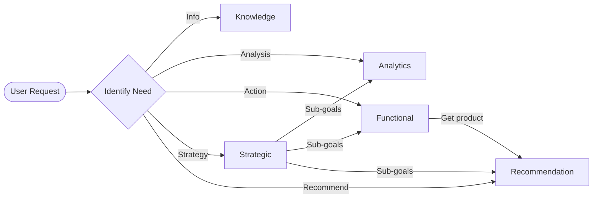

# 🛠️ Agentic AI System – Technical (Non‑Developer) Overview

### What This System Does

This platform uses different AI helpers to manage customer data and automate business tasks. Each helper specialises in a different activity. They are coordinated by a central orchestrator that decides which helper should work on your request.

### How It Works

1. **You Ask a Question or Set a Goal**: For example, “Show me customers with expired KYC” or “Increase credit card adoption.”
2. **The Orchestrator Chooses a Helper**: Simple questions go to the knowledge helper. Analytical tasks go to the analytics helper. Tasks requiring actions, like sending reminders, go to the functional helper. Big goals go to the strategic helper.
3. **Helpers Do the Work**:
   - **Knowledge Helper**: Looks up information and summarises it.
   - **Analytics Helper**: Runs queries and finds patterns in data.
   - **Functional Helper**: Connects to systems to send messages or update records.
   - **Strategic Helper**: Breaks big goals into smaller tasks and monitors progress.
   - **Recommendation Helper**: Generates personalised product suggestions using customer behaviour and cross-user similarity.
4. **Results Are Returned to You**: The system presents the answers, charts or actions taken.

### Decision Flow Diagram

### Important Notes

- The system keeps a unified view of each customer by combining the customer database, communication logs, CRM notes, and policy documents.
- Predictive models can spot late payers and high-value customers.
- Automation and AI agents free up employees to focus on strategic priorities.
- Humans remain in control for important decisions and can override any AI suggestion.

### How to Use

You interact with the system via a chat interface or dashboard. Ask specific questions or set clear goals. The system will either provide the information, perform an action or ask for clarification if needed.

### Support & Troubleshooting

If you receive an error or unexpected result, check that your request is within the system’s capabilities. For complex goals, be as specific as possible. Contact the technical team if tools or integrations fail.
